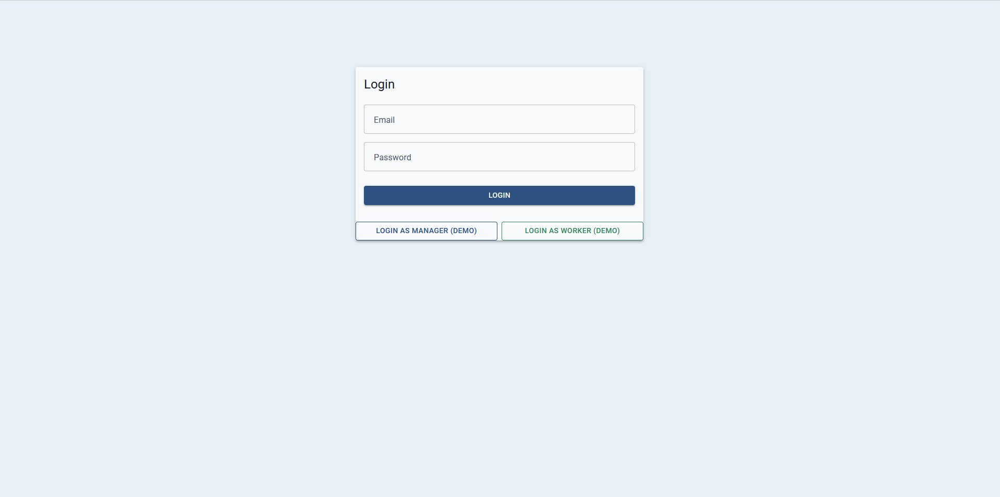
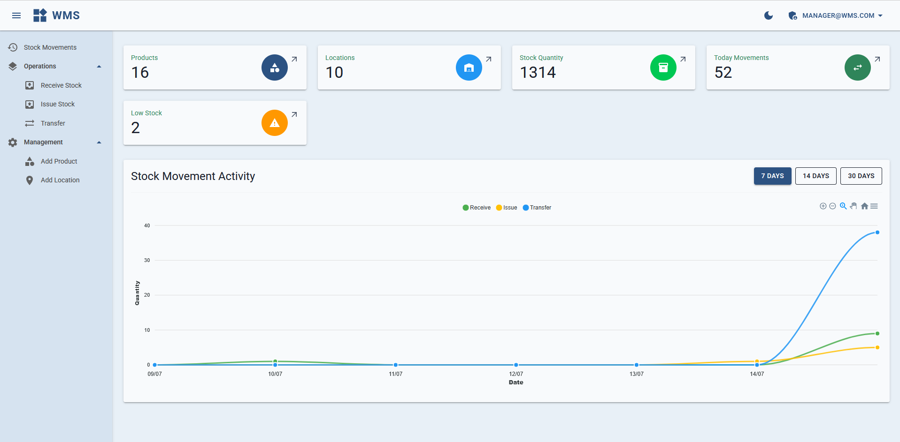
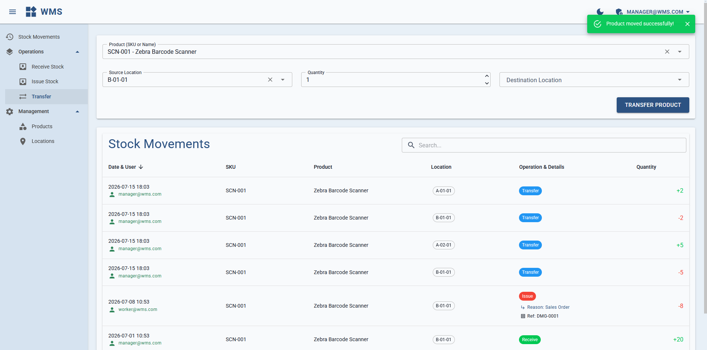
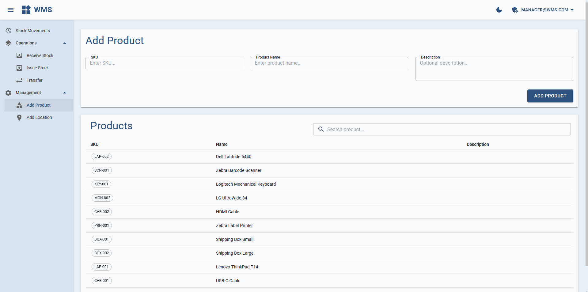

# Warehouse Management System (WMS)


A full-stack Warehouse Management System built with .NET 8, Blazor WebAssembly and Clean Architecture principles, including automated testing of core business processes.

> This project is currently under active development.  
> Features, UI and architecture are continuously improved.

---

## Overview

Warehouse Management System is a personal portfolio project designed to simulate real-world warehouse operations.

## Demo 

A short preview of the current application state:


The application contains demo accounts:

- Manager
- Worker

---

The application focuses on:

- Inventory management
- Stock movement tracking
- Warehouse operations
- Authentication and authorization
- Maintainable backend architecture

---

## Features

### Authentication & Authorization

- JWT authentication
- ASP.NET Core Identity
- Role-based access control

Available roles:

- Manager
- Worker

---

### Inventory Management

Implemented warehouse operations:

- Product management  
- Warehouse locations  
- Stock tracking  
- Receive stock  
- Issue stock  
- Internal stock transfer  
- Stock movement history  
- Low stock monitoring  

---

### Dashboard & Analytics

Dashboard provides:

- Inventory statistics
- Current stock overview
- Low stock information
- Stock movement charts

Charts are implemented using **ApexCharts**.

---

## Architecture

The project follows **Clean Architecture**:

WMS.Client
    ↓
WMS.Api
    ↓
WMS.Application
    ↓
WMS.Domain

```
               WMS.Client
                    |
                 WMS.Api
                    |
             WMS.Application
                    |
               WMS.Domain
```
WMS.Infrastructure implements Application interfaces

Main concepts used:

- CQRS with MediatR
- Repository Pattern
- Unit of Work
- Dependency Injection
- Domain-driven design principles
- Global exception handling

---

## Testing

The project includes automated unit, integration and API tests covering core business processes.

Testing approach includes:

- Unit testing of domain entities and business rules
- Application layer testing with mocked dependencies
- API integration testing using WebApplicationFactory
- Designing positive and negative test scenarios
- Validation of business rules and error handling
- Manual REST API testing using Postman and Swagger
- Validation of HTTP responses, authentication flow and CRUD operations

Test stack:

- xUnit
- FluentAssertions
- Moq
- WebApplicationFactory
- SQLite In-Memory
- Coverlet
- ReportGenerator

Detailed testing documentation:

[TESTING.md](TESTING.md)

## Tech Stack

### Backend

- .NET 8
- C#
- ASP.NET Core Web API
- Entity Framework Core
- SQLite
- MediatR
- ASP.NET Core Identity
- JWT

### Frontend

- Blazor WebAssembly
- MudBlazor
- ApexCharts

---

## Database Model

Main entities:

- Product
- WarehouseLocation
- Stock
- StockMovement
- ApplicationUser

Stock movements store historical snapshots of products and locations to preserve operation history.

---

## Screenshots

### Login



### Dashboard



### Stock Transfer



### Add Product



---

## Author

Personal portfolio project created to demonstrate:

- .NET backend development
- API design
- Database modeling
- Frontend integration
- Clean architecture
- Automated software testing
