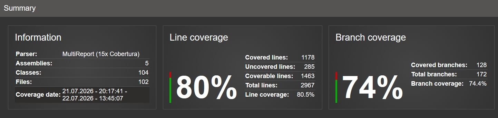

# WMS Automated Tests

This document describes the testing strategy, automated test suites, covered business scenarios and current code coverage results for the Warehouse Management System.

The testing approach combines:

- Unit Testing
- Integration Testing
- Manual API Testing

---

# Test Stack

Automated tests are built using:

- xUnit
- FluentAssertions
- Moq
- WebApplicationFactory
- SQLite In-Memory
- Microsoft.NET.Test.Sdk
- Coverlet
- ReportGenerator

---

# Test Projects

The solution contains three automated test projects.

## WMS.Domain.UnitTests

Tests domain entities and business rules.

Covered scenarios:

- Entity creation validation
- Quantity management rules
- Invalid operations handling
- Domain exceptions


Example:

- Creating stock with invalid quantity
- Increasing stock quantity
- Decreasing stock quantity
- Preventing operations violating business rules

---

## WMS.Application.UnitTests

Tests application logic with mocked dependencies.

Covered scenarios:

- CQRS command handlers
- CQRS query handlers
- Stock operations
- Repository interactions
- Business workflow validation


Example:

- Moving stock between locations
- Creating stock movements
- Handling missing data
- Validating operation rules

---

## WMS.Api.IntegrationTests

Tests complete API flows using an application test host.

Covered scenarios:

- REST API endpoints
- HTTP responses
- Database persistence
- End-to-end application behaviour


Example:

- Issuing stock through API
- Validating API error responses
- Checking database state after operations

---

# Automated Test Execution Results

## Test Summary

| Test Project | Tests | Passed | Failed |
|---|---:|---:|---:|
| WMS.Api.IntegrationTests | 59 | 59 | 0 |
| WMS.Application.UnitTests | 63 | 63 | 0 |
| WMS.Domain.UnitTests | 56 | 56 | 0 |
| **Total** | **178** | **178** | **0** |

---

# Code Coverage

Coverage is generated using:

- Coverlet
- XPlat Code Coverage
- ReportGenerator

Coverage summary:



Coverage analysis excludes non-testable application parts:

Excluded projects:

- WMS.Client (Blazor WebAssembly UI)
- WMS.Infrastructure.Migrations (database migration files)

Coverage focuses on backend business logic, application services and API layers.

---

# Tested Functional Areas

The automated tests currently cover:

- Stock entity behaviour
- Inventory quantity validation
- Stock transfer operations
- Stock issue operations
- Product workflows
- Warehouse location workflows
- CQRS command handling
- CQRS query handling
- Repository behaviour
- API endpoint responses
- Validation scenarios
- Exception handling
- Database integration scenarios

---

# Example Test Scenarios

## Stock Transfer

**Scenario**

Move stock from one warehouse location to another.

**Verified behaviour**

- Source quantity is decreased.
- Destination quantity is increased.
- Stock movement records are created.
- Source stock is removed when quantity reaches zero.

---

## Stock Issue

**Scenario**

Remove available stock from inventory.

**Verified behaviour**

- Stock quantity is decreased.
- Stock movement history is created.
- Operation fails when requested quantity exceeds available stock.
- Correct HTTP response is returned for invalid operations.

---

## Authentication Endpoint

**Scenario**

Authenticate user through API endpoint.

**Verified behaviour**

- Valid credentials return authentication response.
- Authenticated requests can access protected endpoints.

---

# Manual REST API Testing

Manual REST API verification was performed using Postman and Swagger.

Validated areas include:

- Authentication flow
- Product management
- Warehouse location management
- Stock operations

The tests covered:

- HTTP status code validation
- API response verification
- CRUD workflows
- Authenticated requests
- Positive and negative scenarios
- Validation of incorrect input data
- Business rule validation

---

# Running Tests

Run automated tests:

```bash
dotnet test --settings WMS.runsettings
```

Generate coverage data:

```bash
dotnet test --settings WMS.runsettings --collect:"XPlat Code Coverage"
```

Generate HTML coverage report:

```bash
reportgenerator \
-reports:**/coverage.cobertura.xml \
-targetdir:coveragereport \
-reporttypes:Html \
-classfilters:"-WMS.Infrastructure.Migrations.*" \
-assemblyfilters:"-WMS.Client"
```

---

# Test Strategy

The project follows a layered testing approach:

```
          Integration Tests
                    |
          Application Tests
                    |
             Domain Tests
```

Domain tests verify business rules and entity behaviour.

Application tests verify business workflows and application logic.

Integration tests verify complete workflows between API, application layer and database.

---
